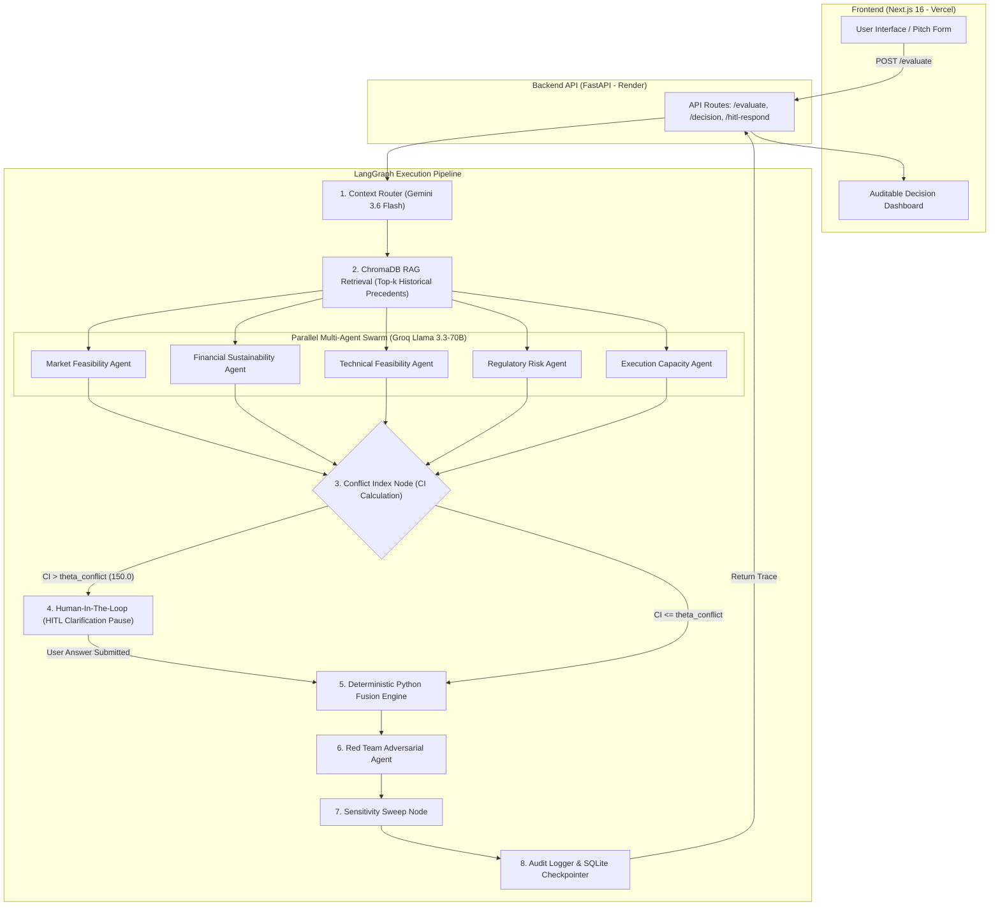
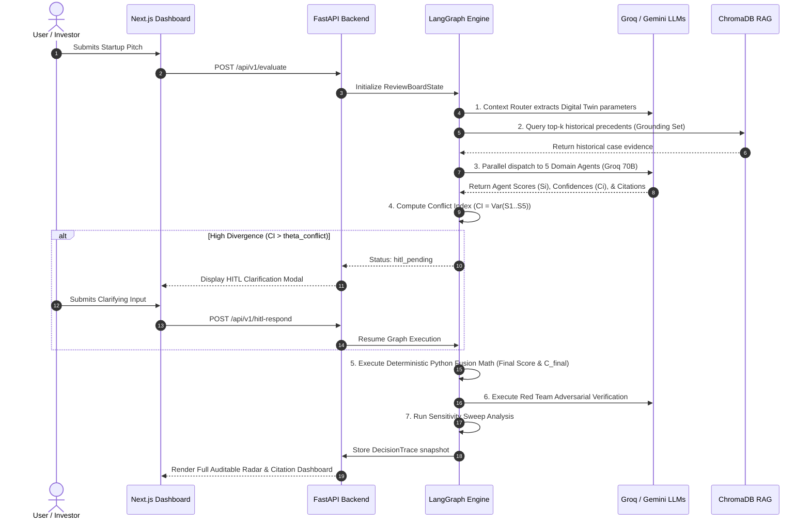

# AIRB — Evidence-Calibrated Multi-Agent Decision Fusion Framework

> A research-grade startup-feasibility evaluator where five domain-specialist LLM agents debate historical precedent, and a deterministic Python layer — not an LLM judge — fuses their opinions into an auditable **PROCEED** / **HIGH-RISK** / **REVIEW** verdict.

[](https://fastapi.tiangolo.com/)
[](https://nextjs.org/)
[](https://github.com/langchain-ai/langgraph)
[](https://groq.com/)
[](https://aistudio.google.com/)
[](LICENSE)

---

## 📐 Architecture Overview



---

## 🔄 End-to-End Execution Workflow



---

## ⚡ Key Architecture Principles

> **Strict Separation of Concerns**: All subjective evaluation and citation matching stays inside the LLM agent layer. All weighting, score fusion, confidence calculations ($C_{final}$), and conflict detection ($CI$) are computed by deterministic Python math — **zero LLM calls inside the decision engine**.

1. **Evidence-Grounded**: Every score $S_i$ emitted by an agent must cite specific historical case IDs from ChromaDB.
2. **Conflict-Aware HITL**: If domain agents diverge significantly ($CI = \text{Var}(S_1 \dots S_5) > \theta_{conflict}$), execution pauses safely for human intervention.
3. **Reproducibility & Auditability**: Every decision snapshot records exact model versions, dataset versions, prompt versions, and initial weights.
4. **Data Isolation Hard Gate**: Test-set cases are strictly excluded from vector indexing ($F-03$) to prevent evaluation data leakage.

---

## 📁 Repository Structure

```text
pjt/
├── render.yaml               # Render Blueprint deployment specification
├── README.md                 # System architecture, setup & deployment documentation
├── backend/                  # Python FastAPI + LangGraph Backend
│   ├── main.py               # FastAPI entry point & CORS configuration
│   ├── config.py             # Typed configuration loader
│   ├── config.yaml           # Centralized thresholds & system hyper-parameters
│   ├── requirements.txt      # Python dependencies
│   ├── api/                  # REST API endpoints (/evaluate, /decision, /hitl-respond, /replay)
│   ├── dataset/              # LLM-assisted labeling pipeline & Cohen's kappa validator
│   ├── graph/                # LangGraph state machine topology & node implementations
│   │   └── nodes/            # Context Router, Retrieval, Parallel Dispatch, Fusion, HITL, etc.
│   ├── rag/                  # ChromaDB vector index ingestion, embedding & split manager
│   ├── schemas/              # Pydantic models & TypedDict ReviewBoardState definitions
│   └── tests/                # Pytest automated unit test suite
└── frontend/                 # Next.js 16 Web Dashboard
    ├── app/                  # Next.js App Router (Pitch Form & Decision Dashboard)
    ├── components/           # UI Components (PitchForm, Dashboard, HITLModal, Navbar)
    ├── lib/api.ts            # Type-safe API client wrapper
    ├── package.json          # Node dependencies & scripts
    └── tsconfig.json         # TypeScript configuration
```

---

## 🚀 Deployment Guide (100% Free Tier)

### 1. Backend on Render (Web Service)

#### Option A: Render Blueprint (Recommended)
1. Go to [Render Dashboard](https://dashboard.render.com/) → **New +** → **Blueprint**.
2. Connect your GitHub repository `Darshil-Ag/pjt`.
3. Render automatically parses `render.yaml` with pre-set build/start commands.
4. Add your API keys under Environment Variables:
   * `GROQ_API_KEY`: Your Groq API key
   * `GOOGLE_API_KEY`: Your Google AI Studio key
5. Click **Apply**.

#### Option B: Manual Web Service
* **Root Directory**: `backend`
* **Environment**: `Python 3`
* **Build Command**: `pip install -r requirements.txt`
* **Start Command**: `uvicorn main:app --host 0.0.0.0 --port $PORT`
* **Environment Variables**:
  * `PYTHON_VERSION`: `3.11.0`
  * `GROQ_API_KEY`: `your_groq_key`
  * `GOOGLE_API_KEY`: `your_google_key`

> 💡 **Free Tier Cold-Start Optimization**: Set up a free monitor at [UptimeRobot](https://uptimerobot.com/) to ping `https://your-backend.onrender.com/health` every 10 minutes to prevent Render from going to sleep.

---

### 2. Frontend on Vercel

1. Go to [Vercel Dashboard](https://vercel.com/new) → Import repository `Darshil-Ag/pjt`.
2. Configure settings:
   * **Framework Preset**: `Next.js`
   * **Root Directory**: Select `frontend`
3. Add Environment Variable:
   * `NEXT_PUBLIC_API_URL`: `https://your-backend-name.onrender.com/api/v1`
4. Click **Deploy**.

---

## 💻 Local Development Setup

### Backend Setup

```powershell
# Navigate to backend directory
cd backend

# Create and activate virtual environment
python -m venv .venv
.venv\Scripts\Activate.ps1

# Install dependencies
pip install -r requirements.txt

# Create .env file
copy .env.example .env
# Edit .env to add your GROQ_API_KEY and GOOGLE_API_KEY

# Run automated tests
.venv\Scripts\python.exe -m pytest

# Start development server
.venv\Scripts\python.exe -m uvicorn main:app --reload --port 8000
```
Backend API interactive documentation is available at `http://localhost:8000/docs`.

### Frontend Setup

```powershell
# Navigate to frontend directory
cd frontend

# Install Node dependencies
npm install

# Build & run production or dev server
npm run dev
```
Open `http://localhost:3000` in your browser.

---

## 📊 Evaluation & Verification

The backend includes a comprehensive pytest suite covering math fusion deterministic stability, conflict index triggering thresholds, evidence scoring bounds, and dataset disjointness.

```powershell
cd backend
pytest tests/ -v
```

```text
tests/test_sprint1.py::TestFusionNode::test_tc08_hand_calculated PASSED
tests/test_sprint1.py::TestConflictIndex::test_high_variance_triggers_conflict PASSED
tests/test_sprint1.py::TestConfidenceFormula::test_m_evidence_pure_function_all_match PASSED
tests/test_sprint1.py::TestDatasetIntegrity::test_ingest_splits_are_disjoint PASSED
============================= 16 passed in 1.12s ==============================
```

---

## 🛡️ License

Distributed under the MIT License. See `LICENSE` for details.
